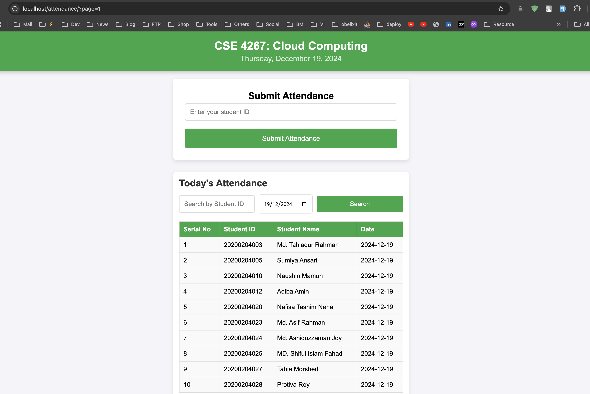
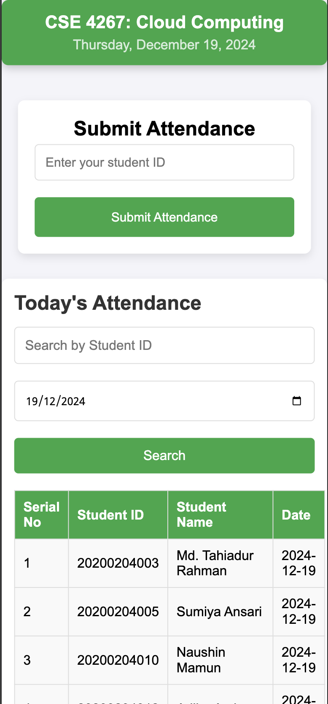

# Attendance Management System
 
This is a simple web-based Attendance Management System that allows users to manage attendance records. The system features a user-friendly interface, enabling users to efficiently add, view, and search attendance data.

---

## Features

- **Add Attendance**: Users can easily input attendance data through a form.
- **View Attendance List**: Displays a comprehensive list of all attendance records.
- **Search Records**: Filter and search for specific attendance records based on the student's name or date.
- **Pagination**: Navigate through multiple pages of attendance records for better manageability.
- **Mobile Responsive**: Fully responsive design that works seamlessly across desktop, tablet, and mobile devices.

---

## Technologies Used

- **HTML5**: Markup and structure of the web pages.
- **CSS3**: Styling and layout of the application.
- **JavaScript**: Frontend functionality for interaction and data manipulation.
- **PHP**: Backend server-side scripting (optional, depending on future backend integration).

---

## Setup Instructions

### Prerequisites
- A modern web browser (e.g., Chrome, Firefox, Edge).
- A text editor (e.g., VS Code) for any customization or development.
- PHP (optional for backend functionalities like database integration).
- **Composer**: Dependency management for PHP.

### Steps

1. Clone or download the repository:
   ```bash
   git clone https://github.com/srkonok/student_attendance.git
   ```

2. Navigate to the project directory:
   ```bash
   cd student_attendance
   ```

3. Install project dependencies using Composer:
   ```bash
   composer install
   ```

4. Copy the environment configuration file (if applicable):
   ```bash
   cp env.example .env
   ```

5. Open the `index.html` file in a browser:
   - Double-click the file in your file explorer to open it directly in the browser.
   - Alternatively, use a tool like Live Server in VS Code for local development.

---

## File Structure

```
attendance-management-system/
|-- index.html          # Main HTML file for the web page
|-- styles.css          # CSS file containing the styles
|-- script.js           # JavaScript file for frontend functionality
|-- README.md           # Project documentation (this file)
```

---

## Features Overview

### Add Attendance
- Easily input attendance data using a user-friendly form.
- After submission, the attendance list updates instantly with the new record.

### Search Records
- Use the search bar to dynamically filter and display attendance records based on user input.

### Pagination
- Navigate through a large number of records with pagination controls.
- Records are displayed in a paginated format to avoid clutter and improve usability.

### Responsiveness
- The system adapts its layout for optimal viewing on various devices including desktops, tablets, and smartphones.

---


## Screenshots

### Desktop View


### Mobile View



## Future Enhancements

- **Backend Integration**: Connect to a database (e.g., MySQL, PostgreSQL) for persistent storage of attendance records.
- **Authentication**: Implement user login/logout functionality to secure attendance data.
- **Export Data**: Enable users to export attendance data to CSV or Excel format for reporting purposes.
- **Enhanced Validation**: Implement more advanced form validation to ensure data integrity.

---

## License
This project is open-source and available under the [MIT License](LICENSE).

---

## Contributing
Contributions are welcome! If you have suggestions or improvements, please feel free to open an issue or submit a pull request.

